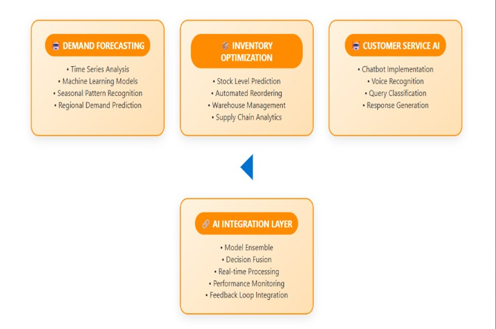

# Walmart AI Retail Project

# 🛒 Walmart AI Retail Simulation

This project simulates how Walmart leverages **Artificial Intelligence (AI)** for optimizing inventory management, forecasting demand, and enhancing customer service using a structured data pipeline and machine learning.

---

## 🚀 Project Highlights

- 📦 Inventory data processing
- 📈 Demand forecasting with machine learning
- 🤖 AI-based customer query handling
- 🛎️ Real-time low-stock alert system

---

## 🧠 Workflow Diagram

